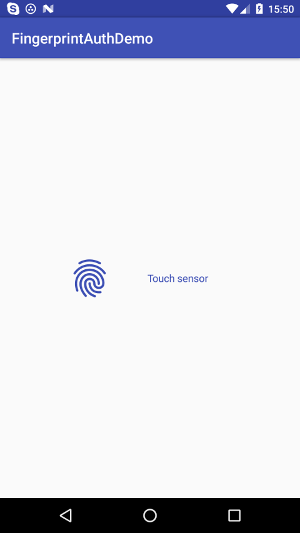
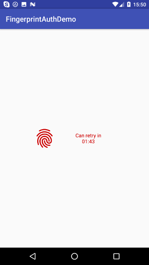

# FingerprintAuthHelper
A small library that allows You to easily manage fingererprint authentication inside your Activity or Fragment on devices with fingerprint scanner and Android M and higher.
Min sdk version 14.

1. [Demo app](https://play.google.com/store/apps/details?id=com.pro100svitlo.fingerprintAuthHelper)
2. [Usage](#usage)
3. [Documentation](Docs.md)
3. [Callbacks](#callbacks)
4. [Updates](#updates)
5. [Used In](#used-in)
6. [Questions and help](#questions-and-help)
7. [License](#license)





# Usage
##### Add the dependencies to your gradle file:
```sh
    dependencies {
        compile 'com.github.pro100svitlo:fingerprintAuthHelper:1.1.3'
    }
```

##### Inside your activity or fragment:

```sh

    private FingerprintAuthHelper mFAH;
    
    @Override
    protected void onCreate(Bundle savedInstanceState) {
    ...
        mFAH = new FingerprintAuthHelper
                .Builder(this, this) //(Context inscance of Activity, FahListener)
                .build();

        if (mFAH.isHardwareEnable()){
            //do some stuff here
        } else {
            //otherwise do
        }
    }
    
    ...
    
   @Override
    protected void onResume() {
        super.onResume();
        mFAH.startListening();
    }
 
    ...
    
    @Override
    protected void onPause() {
        super.onPause();
        mFAH.stopListening();
    }
 
    ...
    
    @Override
    protected void onDestroy() {
        super.onDestroy();
        mFAH.onDestroy();
    }
```
That's pretty much all what you need to start the work!
Full documentation and all options descriptions you can find [here](Docs.md).

---

### Callbacks:

Your activity or fragment must implement FahListener;
 
```sh
    @Override
    public void onFingerprintStatus(boolean authSuccessful, int errorType, CharSequence errorMess) {
        // authSuccessful - boolean that shows auth status
        // errorType - if auth was failed, you can catch error type
        // errorMess - if auth was failed, errorMess will tell you (and user) the reason
        
        if (authSuccessful){
            // do some stuff here in case auth was successful
        } else if (mFAH != null){
          // do some stuff here in case auth failed
            switch (errorType){
                case FahErrorType.General.LOCK_SCREEN_DISABLED:
                case FahErrorType.General.NO_FINGERPRINTS:
                    mFAH.showSecuritySettingsDialog();
                    break;
                case FahErrorType.Auth.AUTH_NOT_RECOGNIZED:
                    //do some stuff here
                    break;
                case FahErrorType.Auth.AUTH_TO_MANY_TRIES:
                    //do some stuff here
                    break;
            }
        }
    }

    @Override
    public void onFingerprintListening(boolean listening, long milliseconds) {
        // listening - status of fingerprint listen process
        // milliseconds - timeout value, will be > 0, if listening = false & errorType = AUTH_TO_MANY_TRIES
        
        if (listening){
            //add some code here
        } else {
            //add some code here
        }
        if (milliseconds > 0) {
            //if u need, u can show timeout for user
        }
    }
```

### Updates
* v.1.1.3
    1. init context must be instance of Activity
    2. add method showSecuritySettingsDialog() to FingerprintAuthHelper
    3. add help error
* v.1.1.2
    1. add possibility to set max count of tries

### Questions and help
If you have some problems with using this library or something doesn't work correctly - just write me an email and describe your question or problem. I will try to do my best to help you and fix the problem if it exists. Here is my email: pro100svitlo@gmail.com

### Used in
If you use this library, please, let me know (pro100svitlo@gmail.com)
Thanks!

1. [Bank of Georgia (TskApp)]


### License
The MIT License (MIT)

Copyright (c) 2016 FingerprintAuthHelper

Permission is hereby granted, free of charge, to any person obtaining a copy
of this software and associated documentation files (the "Software"), to deal
in the Software without restriction, including without limitation the rights
to use, copy, modify, merge, publish, distribute, sublicense, and/or sell
copies of the Software, and to permit persons to whom the Software is
furnished to do so, subject to the following conditions:

The above copyright notice and this permission notice shall be included in all
copies or substantial portions of the Software.

THE SOFTWARE IS PROVIDED "AS IS", WITHOUT WARRANTY OF ANY KIND, EXPRESS OR
IMPLIED, INCLUDING BUT NOT LIMITED TO THE WARRANTIES OF MERCHANTABILITY,
FITNESS FOR A PARTICULAR PURPOSE AND NONINFRINGEMENT. IN NO EVENT SHALL THE
AUTHORS OR COPYRIGHT HOLDERS BE LIABLE FOR ANY CLAIM, DAMAGES OR OTHER
LIABILITY, WHETHER IN AN ACTION OF CONTRACT, TORT OR OTHERWISE, ARISING FROM,
OUT OF OR IN CONNECTION WITH THE SOFTWARE OR THE USE OR OTHER DEALINGS IN THE
SOFTWARE.
